# praktikum3
## tugas praktikum 3
### 1.buat kode program menghitung luas dan keliling lingkaran
kode program

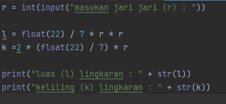

hasil

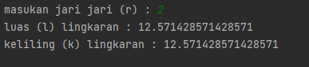

### 2.penjelasan latihan
#### 1.latihan1

- penggunaan end

hasil

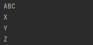

- penggunaan sparator

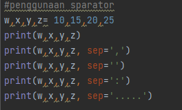

hasil

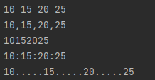

- string format

 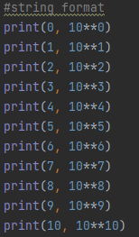

hasil

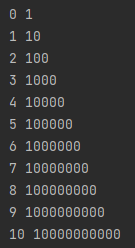

- string format 

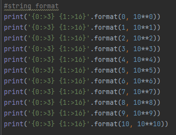

hasil

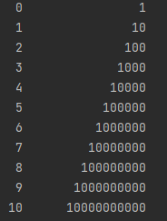

#### 2.latihan2

- konversi nilai variabel

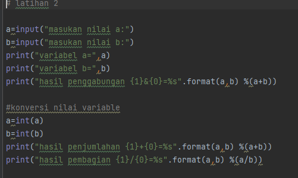

hasil

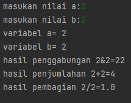

#### latihan3

- membuat program menggunakan string formating

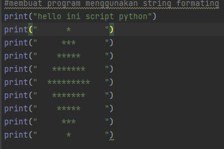

hasil

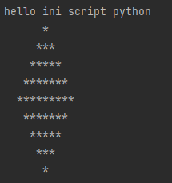

